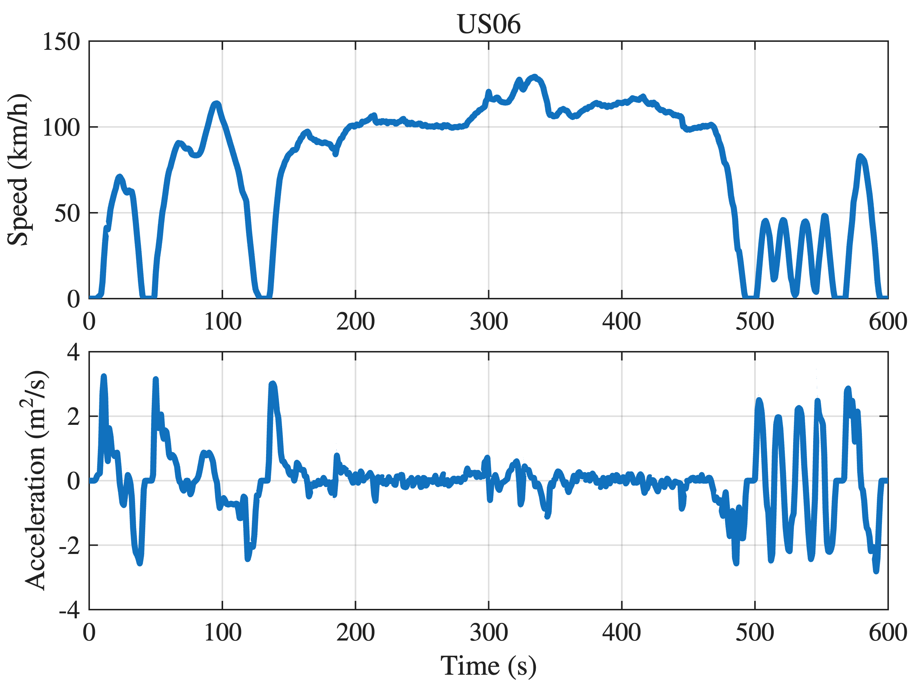
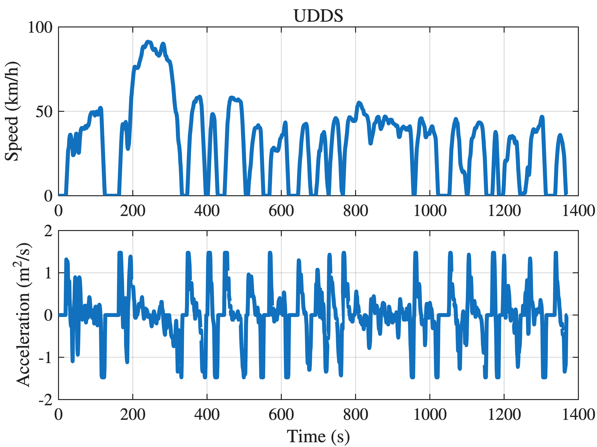
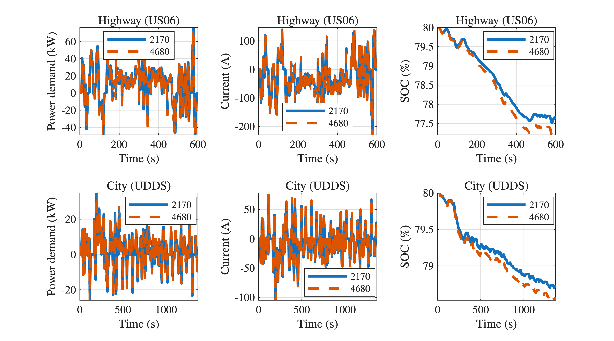

#  **Estimating EV Range from Drive Cycle:** A Case Study on an Electric Vehicle Battery Pack
# **Drive Cycle**

In real\-world conditions, the range of EVs depend on the driving pattern, which is influenced by both external and internal factors such as environment and driving behavior. A drive (or driving) cycle is a set of data points representing the vehicle speed versus time.


Commonly adopted drive cycles include the Urban Dynamometer Driving Schedule (UDDS), which simulates typical driving scenarios on urban roads in North America, and the US06 drive cycle, which represents typical highway driving conditions. Figure below illustrates the two drive cycles along with respective acceleration plots. 

```matlab
clc; clear; close all;

% load drive cycle
US06 = load("Drive Schedules/US06.mat");
UDDS = load("Drive Schedules/UDDS.mat");

plotDriveCycle(US06.time_s,US06.speed_kmph,'US06');
```



```matlab
plotDriveCycle(UDDS.time_s,UDDS.speed_kmph,'UDDS');
```


# Duty cycle

A drive cycle (speed versus time, $v(t)$ ) can be converted into duty cycle (power demand versus time, $P(t)$ ) by considering vehicle dynamics. The power demand at time $t$ is written as 

 $$ P(t)=\left(mg\sin \theta +c_r mg\cos \theta +\frac{1}{2}\rho_{\mathrm{air}} c_d A_f v(t)^2 +mv^{\prime } (t)\right)v(t) $$ 

where $m$ is the vehicle mass, $c_r$ is the rolling resistance coefficient, $g$ is gravity acceleration, $\theta$ is the  slope of the road, $A_f$ is the frontal area, $c_d$ is the air drag coefficient, $\rho_{\mathrm{air}}$ is air density, $v(t)$ is the vehicle speed at time $t$, and $v^{\prime } (t)$ is the acceleration.  

### Battery Pack 1: Tesla Model Y (2170 cells, 96S46P)
```matlab
Vcell_1 = 3.65; % cell voltage in V
Qcell_1 = 4.60; % cell capacity in Ah
Wcell_1 = 68.6/1000; % cell weight in kg 

Nseries_1   = 96;
Nparallel_1 = 46;

Wpack_1 = Nseries_1*Nparallel_1*Wcell_1;
Vpack_1 = Vcell_1*Nseries_1;
Qpack_1 = Qcell_1*Nparallel_1;
Epack_1 = Vpack_1*Qpack_1;
```
### Battery Pack 2: Tesla Model Y  (4680 cells, 92S9P)
```matlab
Vcell_2 = 3.6; % cell voltage in V
Qcell_2 = 22; % cell capacity in Ah
Wcell_2 = 358/1000; % cell weight in kg 

Nseries_2   = 92;
Nparallel_2 = 9;

Wpack_2 = Nseries_2*Nparallel_2*Wcell_2;
Vpack_2 = Vcell_2*Nseries_2;
Qpack_2 = Qcell_2*Nparallel_2;
Epack_2 = Vpack_2*Qpack_2;

```

```matlab
figure(Position=[0,0,900,500]);

P    = dutyCycle(US06.speed_mps,Wpack_1);
I    = - P/Vpack_1; % multiplied by -1 to make discharge current negative
SOC0 = .8;
SOC  = SOC0 + cumtrapz(US06.time_h,I)/Qpack_1;

nexttile(1); hold on; grid on; box on; axis("tight"); legend(Location="best")
xlabel('Time (s)'); ylabel('Power demand (kW)'); title('Highway (US06)')
plot(US06.time_s,P/1000,DisplayName='2170');

nexttile(2); hold on; box on; grid on; axis("tight"); legend(Location="best")
ylabel('Current (A)'); xlabel('Time (s)'); title('Highway (US06)')
plot(US06.time_s,I,DisplayName='2170')

nexttile(3); hold on; box on; grid on; axis("tight"); legend(Location="best")
ylabel('SOC (\%)'); xlabel('Time (s)'); title('Highway (US06)')
plot(US06.time_s,SOC*100,DisplayName='2170')

P   = dutyCycle(UDDS.speed_mps,Wpack_1);
I   = - P/Vpack_1; % multiplied by -1 to make discharge current negative
SOC = SOC0 + cumtrapz(UDDS.time_h,I)/Qpack_1;

nexttile(4); hold on; grid on; box on; axis("tight"); legend(Location="best")
xlabel('Time (s)'); ylabel('Power demand (kW)'); title('City (UDDS)')
plot(UDDS.time_s,P/1000,'-',DisplayName='2170');

nexttile(5); hold on; box on; grid on; axis("tight"); legend(Location="best")
ylabel('Current (A)'); xlabel('Time (s)'); title('City (UDDS)')
plot(UDDS.time_s,I,'-',DisplayName='2170')

nexttile(6); hold on; box on; grid on; axis("tight"); legend(Location="best")
ylabel('SOC (\%)'); xlabel('Time (s)'); title('City (UDDS)')
plot(UDDS.time_s,SOC*100,'-',DisplayName='2170')

P   = dutyCycle(US06.speed_mps,Wpack_2);
I   = - P/Vpack_2; % multiplied by -1 to make discharge current negative
SOC = SOC0 + cumtrapz(US06.time_h,I)/Qpack_2;

nexttile(1)
plot(US06.time_s,P/1000,'--',DisplayName='4680');

nexttile(2)
plot(US06.time_s,I,'--',DisplayName='4680')

nexttile(3)
plot(US06.time_s,SOC*100,'--',DisplayName='4680')

P   = dutyCycle(UDDS.speed_mps,Wpack_2);
I   = - P/Vpack_2; % multiplied by -1 to make discharge current negative
SOC = SOC0 + cumtrapz(UDDS.time_h,I)/Qpack_2;

nexttile(4)
plot(UDDS.time_s,P/1000,'--',DisplayName='4680');

nexttile(5)
plot(UDDS.time_s,I,'--',DisplayName='4680')

nexttile(6)
plot(UDDS.time_s,SOC*100,'--',DisplayName='4680'); clear P I SOC
```


# Vehicle Consumption

The energy consumption for the testing drive cycle is given by the area under the duty cycle, that is, 

 $$ E=\int_{t_0 }^{t_f } P(t)dt=E_{\mathrm{d}} +E_{\mathrm{c}} $$ 

where $t_0$ and $t_f$ are the initial and final times of the testing drive cycle, $E$ is the cumulative energy demand, which can be further divided into cumulative discharge energy $E_{\mathrm{d}} \ge 0$ and cumulative charge energy $E_{\mathrm{c}} \le 0$. 


The total energy consumption of the EV for the testing drive cycle is calculated using 

 $$ E_{\mathrm{vehicle}} =\left(\eta E_{\mathrm{c}} +\frac{E_{\mathrm{d}} }{\eta }\right)(1-c_a ) $$ 

where $\eta$ is the  lumped average powertrain efficiency, and $c_a$ is the auxiliary coefficient for auxiliary energy consumption (i.e.,  headlights, air conditioner, multimedia, etc). 


Now, the energy consumption per kilometer required to estimate the drive cycle range is calculated as

 $$ E_{\mathrm{con}} =\frac{E_{\mathrm{vehicle}} }{D} $$ 

where $D$ denotes the total distance for the testing drive profile  calculated as

&nbsp;&nbsp;&nbsp;&nbsp; $$ D=\int_{t_0 }^{t_f } v(t)dt $$ 
# Drive Cycle Range

The drive cycle range  of an electric battery pack, expressed in kilometers, can be approximately written as

 $$ \mathrm{Range}=\frac{E_{\mathrm{pack}} }{E_{\mathrm{con}} } $$ 

where $E_{\mathrm{pack}}$ is the pack energy and $E_{\mathrm{con}}$ is the vehicle's energy consumption (measured in Wh/km) for a specific drive cycle.

```matlab
Evehicle(1) = vehicleConsumption(dutyCycle(US06.speed_mps,Wpack_1));
Evehicle(2) = vehicleConsumption(dutyCycle(US06.speed_mps,Wpack_2));
Evehicle(3) = vehicleConsumption(dutyCycle(UDDS.speed_mps,Wpack_1));
Evehicle(4) = vehicleConsumption(dutyCycle(UDDS.speed_mps,Wpack_2));

Econ(1) = Evehicle(1)/trapz(US06.time_h,US06.speed_kmph);
Econ(2) = Evehicle(2)/trapz(US06.time_h,US06.speed_kmph);
Econ(3) = Evehicle(3)/trapz(UDDS.time_h,UDDS.speed_kmph);
Econ(4) = Evehicle(4)/trapz(UDDS.time_h,UDDS.speed_kmph);

Range(1) = Epack_1/Econ(1);
Range(2) = Epack_2/Econ(2);
Range(3) = Epack_1/Econ(3);
Range(4) = Epack_2/Econ(4);

Cycle   = ['US06';'US06';'UDDS';'UDDS'];
Vehicle = ['Tesla (2170)';'Tesla (4600)';'Tesla (2170)';'Tesla (4600)'];
T = table(Vehicle,Cycle,Range',VariableNames={'Vehicle (cell format)','Drive cycle','Range (km)'});
disp(T)
```

```matlabTextOutput
    Vehicle (cell format)    Drive cycle    Range (km)
    _____________________    ___________    __________

        Tesla (2170)            US06          439.08  
        Tesla (4600)            US06          389.16  
        Tesla (2170)            UDDS          690.82  
        Tesla (4600)            UDDS          612.95  
```

```matlab
function plotDriveCycle(time_s,speed_kmph,tit)

figure(Position=[0,0,400,300]);
tiledlayout(Padding="tight",TileSpacing="tight"); 

nexttile(1);
title(tit);
hold on; box on; grid on;
ylabel('Speed (km/h)');
plot(time_s,speed_kmph);

speed_mps  = speed_kmph/3.6;
acc = gradient(speed_mps,1);

nexttile(2); hold on; box on; grid on;
xlabel('Time (s)'); ylabel('Acceleration (m$^2$/s)');
plot(time_s,acc);
end

function Pwr = dutyCycle(speed_mps,m)
% Vehicle dynamics
m     = 1300 + m;
g     = 9.81;   % gravitational acceleration in m/s^2
theta = deg2rad(0); % road angle in radian
cr    = 0.013;     % rolling resistance coefficient
Af    = 2.65;         % frontal area in m^2
rho_air = 1.2;     % air density in kg/m^3
cd      = 0.23;    % drag coefficient

acc = gradient(speed_mps,1);

Pwr = (cr*m*g*cos(theta) + m*g*sin(theta) + ...
    (.5*cd*rho_air*Af*speed_mps.^2) + m*acc).*speed_mps; % in Watts
end

function Evehicle = vehicleConsumption(Pwr)

eta  = 0.8;   % powertrain efficiency
caux = 0.12;  % auxiliary coefficient

% Numerical integration
Ed = 0;
Ec = 0;
dt = 1/3600; % in hour
for i = 1:length(Pwr)
    if Pwr(i) > 0
        Ed =  Ed + Pwr(i)*dt;
    else
        Ec = Ec + Pwr(i)*dt;
    end
end

Evehicle = ((Ec*eta)+(Ed/eta))*(1-caux);
end
```
